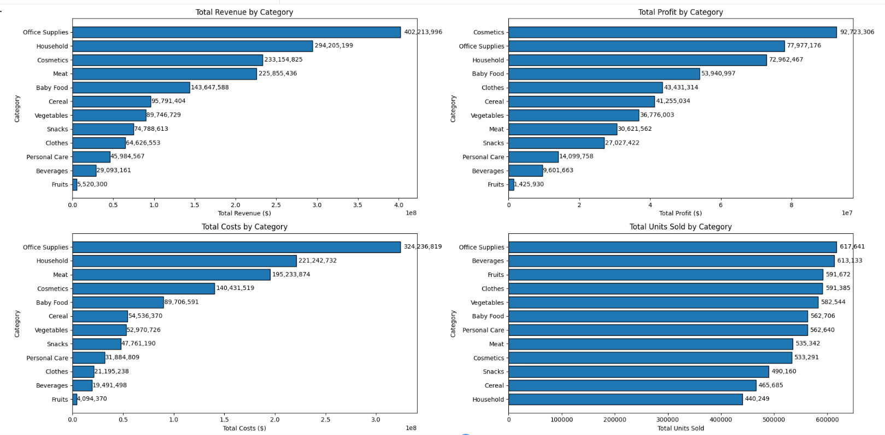
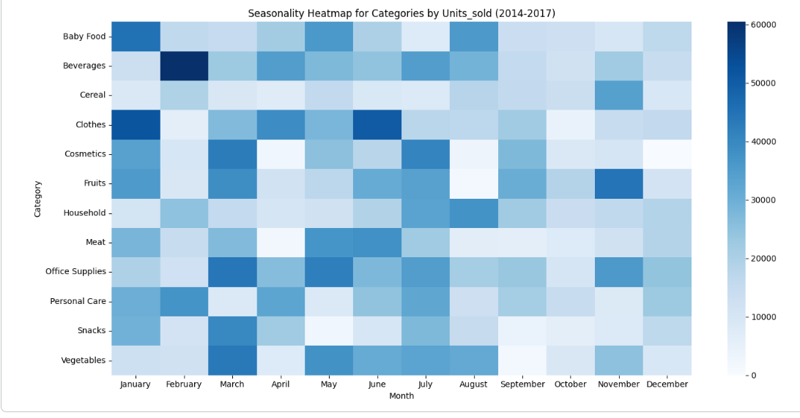

## Project Overview
This project focuses on the comprehensive analysis of a global retail dataset, covering sales across physical and online stores over several years. The goal was to perform deep data cleaning, integrate multiple data sources, and extract actionable business insights regarding profitability, logistics, and consumer behavior.

## 📁 Dataset Description
The analysis is based on three interconnected tables:
* **`events.csv`**: Transactional data (sales, dates, costs, shipping info).
* **`products.csv`**: Product catalog with categories and unique codes.
* **`countries.csv`**: Geographic mapping (countries, regions, and codes).

## Project Phases

### 1. Data Cleaning & Preprocessing
* **Missing Values:** Identified and handled null values based on statistical relevance.
* **Type Conversion:** Corrected data types for dates and financial metrics.
* **Deduplication:** Performed advanced string cleaning (trimming spaces, case normalization, and Cyrillic/Latin character check).
* **Anomaly Detection:** Identified and investigated outliers in sales volumes and shipping durations.

### 2. Exploratory Data Analysis (EDA)
* **Key Metrics:** Calculated Total Orders, Revenue, Total Profit, and Geographic Reach.
* **Sales Performance:** Analyzed revenue and popularity across **Product Categories**, **Geographies**, and **Sales Channels** (Online vs. Offline).
* **Logistics Analysis:** Investigated the interval between order date and shipment date across regions and categories.
* **Correlation Study:** Analyzed the relationship between shipping speed and overall profitability.

### 3. Time-Series & Seasonal Trends
* Analyzed sales dynamics over time to identify growth trends.
* Evaluated weekday sales patterns to determine product seasonality.

## Tech Stack
* **Language:** Python (Pandas, NumPy)
* **Visualization:** Matplotlib, Seaborn
* **Environment:** Google Colab

## * **[View results on Google Colab](https://colab.research.google.com/drive/1AlV5IAcvsGVyWlAl8RxUjAsZlb8yEfh4?usp=sharing)**
##* **[View PDF FILE](./report_analysis.pdf)**
##* **[View IPYNB File](./project__analysis_for_online_store.ipynb)**

## Key Business Insights
* The leading region is **Europe** (448.5M USD), particularly ***Southern Europe*** subregion (166.2M USD).
* The business relies heavily on high-volume, low-margin categories, but most profit comes from Office Supplies, Household, and Cosmetics.**

### 📈 Visualizations
****
****
---
*This project serves as a practical case study in Data Analytics, showcasing end-to-end data pipeline management.*
